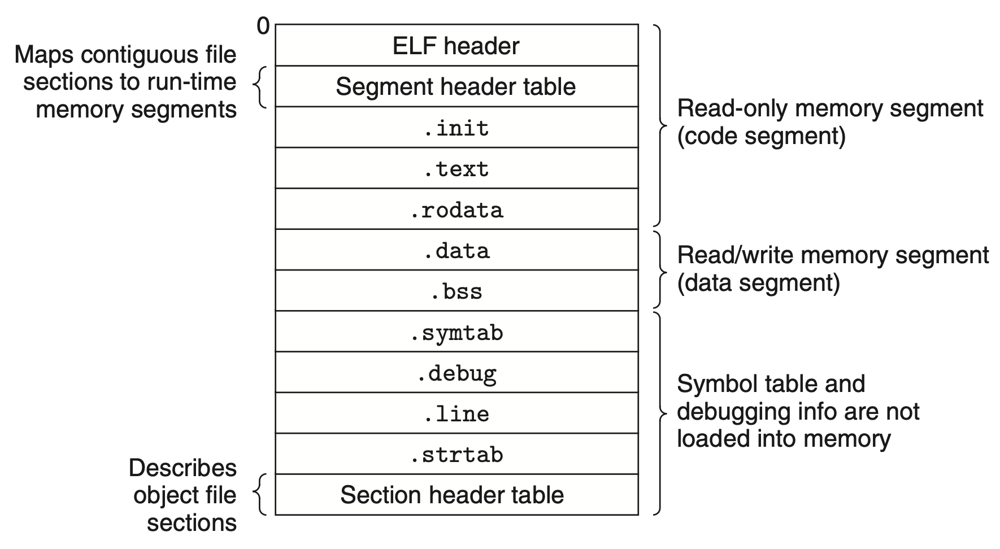

Dans cette article, on va voir comment faire un code qui crash le plus efficacement possible. 
Cela veut dire comprendre ce qu'est un segfault, marche la fonction main ainsi que le code avant.

Une magnifique occasion de faire de l'assembleur !

Sans plus attendre, voici notre premier exemple : 
<!-- truncate --> 
```c
main;
```
Il compile trés bien. 
> gcc main.c -o main

et produit cet output

```sh
$ ./main
[1]    20677 segmentation fault (core dumped)  ./main
```

### Un segfault
Je pense que c'est le bon moment, c'est quoi un segfault ? 

TODO : Explication 

## On dump des obj 
Pour mieux comprendre le fonctionnement du programme, on va allez voir le code machine. 
Le `-t` nous permet de juste recuperer la liste des symboles.
```sh
$ objdump -t ./main
# <-- truncate --> 
0000000000004000  w      .data	0000000000000000              data_start
0000000000004000 g       .data	0000000000000000              __data_start
0000000000001020 g     F .text	0000000000000026              _start
0000000000004010 g       .bss	0000000000000000              __bss_start
0000000000004014 g     O .bss	0000000000000004              main
# <-- truncate --> 
0000000000001000 g     F .init	0000000000000000              .hidden _init
```
On remarque le symbol `main` est dans le segment `.bss` et pas dans `.text`.



Segment Bss : 
> Block starting symbol (abbreviated to .bss or bss) is the portion of an object file, executable, or assembly language code that contains statically allocated variables

Segment Text :
> Text segment or simply as text, is a portion of an object file or the corresponding section of the program's virtual address space that contains executable instructions


On rend compte que notre code ne declare pas une fonction mais bien une variable. La variable etant global le compilateur cree un symbole pour elle.
Cela se verifie tres simplement en rajoutant une variable `test` dans notre code. 
```sh
0000000000004018 g     O .bss	0000000000000004              test
```

En effet, le nom `main` n'est pas un keyword specifique en C. C'est juste un nom de fonction arbitraire qui est appellee au lancement du programme. 

## Pour les quebecois
Pour les puristes d'entre vous, il est tout a fait possible de ne pas mettre de fonction `main` dans votre code.
Il vous suffit d'ecrire votre propre fonction `_start` et de demander a GCC de ne pas link la sienne.
```c

#include <stdio.h>
#include <stdlib.h>

int principale() {
  puts("Hey là, ça marche-tu?");
  return 0;
}

void _start() {
  int ret = principale();
  exit(ret);
}

```
> $ gcc principale.c -o principale -nostartfiles

## Lancement du programme
Mais d'ailleurs, qui call le `main` ? 

Cette fois ci, nous allons devoir regarder le code assembleur de notre code et plus specifiquement la fonction `_start`. 
Au passage, on remarque que son symbol est bien dans le segment `.text`.

Ceci est un code simplifier parce que la fonction est assez complexe et longue.

```asm
_start: 
    xor %ebp, %ebp            
    mov (%rsp), %edi          
    lea 8(%rsp), %rsi         
    lea 16(%rsp,%rdi,8), %rdx 
    xor %eax, %eax            
    call main                 

    mov %eax, %edi    
    xor %eax, %eax   
    call _exit      
```

Le symbol `_start` est le point d'entrée du programme, il n'est pas toujours a la meme addresse. Elle est definie par le programme `ld`.
Pour resumer, on :
- marque la fin de la stack frame
    > xor %ebp, %ebp            
- set argc
    > mov (%rsp), %edi          
- set argv
    > lea 8(%rsp), %rsi
- set envp
    > lea 16(%rsp,%rdi,8), %rdx 
- set a 0, le return code (pour de la comptatibilité)
    > xor %eax, %eax
- call la fonction main avec main(argc, argv, envp)
    > call main                 
- call la fonction _exit avec le return code
    > mov %eax, %edi    
    xor %eax, %eax   
    call _exit      

### Envp ?? 
Le vrai prototype de la fonction main a 3 arguments. 
```c
int main(int argc, char* argv[], char* envp[]);
```
> Oui, j'ai vraiment decouvert le vrai prototype de la fonction main en faisant le reverse de la '_start'.

Vous pouvez vous en doutez avec le nom, ce sont les variables d'environment du shell.
Si on ne vous a jamais montré cela, c'est parce que ce n'est pas portable (meme si toute les machines actuels le supportent).


Source : 
- [The C Runtime Initialization, crt0.o](https://www.embecosm.com/appnotes/ean9/html/ch05s02.html)

### Bonus

Pour les chads ! Voici le code complet de la fonction `_start`.

<details>
```asm
0000000000001020 <_start>:
    1020:	f3 0f 1e fa          	endbr64
    1024:	31 ed                	xor    %ebp,%ebp
    1026:	49 89 d1             	mov    %rdx,%r9
    1029:	5e                   	pop    %rsi
    102a:	48 89 e2             	mov    %rsp,%rdx
    102d:	48 83 e4 f0          	and    $0xfffffffffffffff0,%rsp
    1031:	50                   	push   %rax
    1032:	54                   	push   %rsp
    1033:	45 31 c0             	xor    %r8d,%r8d
    1036:	31 c9                	xor    %ecx,%ecx
    1038:	48 8d 3d d5 2f 00 00 	lea    0x2fd5(%rip),%rdi        # 4014 <main>
    103f:	ff 15 7b 2f 00 00    	call   *0x2f7b(%rip)        # 3fc0 <__libc_start_main@GLIBC_2.34>
    1045:	f4                   	hlt
    1046:	66 2e 0f 1f 84 00 00 	cs nopw 0x0(%rax,%rax,1)
    104d:	00 00 00
    1050:	48 8d 3d b9 2f 00 00 	lea    0x2fb9(%rip),%rdi        # 4010 <__TMC_END__>
    1057:	48 8d 05 b2 2f 00 00 	lea    0x2fb2(%rip),%rax        # 4010 <__TMC_END__>
    105e:	48 39 f8             	cmp    %rdi,%rax
    1061:	74 15                	je     1078 <_start+0x58>
    1063:	48 8b 05 5e 2f 00 00 	mov    0x2f5e(%rip),%rax        # 3fc8 <_ITM_deregisterTMCloneTable@Base>
    106a:	48 85 c0             	test   %rax,%rax
    106d:	74 09                	je     1078 <_start+0x58>
    106f:	ff e0                	jmp    *%rax
    1071:	0f 1f 80 00 00 00 00 	nopl   0x0(%rax)
    1078:	c3                   	ret
    1079:	0f 1f 80 00 00 00 00 	nopl   0x0(%rax)
    1080:	48 8d 3d 89 2f 00 00 	lea    0x2f89(%rip),%rdi        # 4010 <__TMC_END__>
    1087:	48 8d 35 82 2f 00 00 	lea    0x2f82(%rip),%rsi        # 4010 <__TMC_END__>
    108e:	48 29 fe             	sub    %rdi,%rsi
    1091:	48 89 f0             	mov    %rsi,%rax
    1094:	48 c1 ee 3f          	shr    $0x3f,%rsi
    1098:	48 c1 f8 03          	sar    $0x3,%rax
    109c:	48 01 c6             	add    %rax,%rsi
    109f:	48 d1 fe             	sar    $1,%rsi
    10a2:	74 14                	je     10b8 <_start+0x98>
    10a4:	48 8b 05 2d 2f 00 00 	mov    0x2f2d(%rip),%rax        # 3fd8 <_ITM_registerTMCloneTable@Base>
    10ab:	48 85 c0             	test   %rax,%rax
    10ae:	74 08                	je     10b8 <_start+0x98>
    10b0:	ff e0                	jmp    *%rax
    10b2:	66 0f 1f 44 00 00    	nopw   0x0(%rax,%rax,1)
    10b8:	c3                   	ret
    10b9:	0f 1f 80 00 00 00 00 	nopl   0x0(%rax)
    10c0:	f3 0f 1e fa          	endbr64
    10c4:	80 3d 45 2f 00 00 00 	cmpb   $0x0,0x2f45(%rip)        # 4010 <__TMC_END__>
    10cb:	75 33                	jne    1100 <_start+0xe0>
    10cd:	55                   	push   %rbp
    10ce:	48 83 3d 0a 2f 00 00 	cmpq   $0x0,0x2f0a(%rip)        # 3fe0 <__cxa_finalize@GLIBC_2.2.5>
    10d5:	00
    10d6:	48 89 e5             	mov    %rsp,%rbp
    10d9:	74 0d                	je     10e8 <_start+0xc8>
    10db:	48 8b 3d 26 2f 00 00 	mov    0x2f26(%rip),%rdi        # 4008 <__dso_handle>
    10e2:	ff 15 f8 2e 00 00    	call   *0x2ef8(%rip)        # 3fe0 <__cxa_finalize@GLIBC_2.2.5>
    10e8:	e8 63 ff ff ff       	call   1050 <_start+0x30>
    10ed:	c6 05 1c 2f 00 00 01 	movb   $0x1,0x2f1c(%rip)        # 4010 <__TMC_END__>
    10f4:	5d                   	pop    %rbp
    10f5:	c3                   	ret
    10f6:	66 2e 0f 1f 84 00 00 	cs nopw 0x0(%rax,%rax,1)
    10fd:	00 00 00
    1100:	c3                   	ret
    1101:	66 66 2e 0f 1f 84 00 	data16 cs nopw 0x0(%rax,%rax,1)
    1108:	00 00 00 00
    110c:	0f 1f 40 00          	nopl   0x0(%rax)
    1110:	f3 0f 1e fa          	endbr64
    1114:	e9 67 ff ff ff       	jmp    1080 <_start+0x60>
```
</details>
