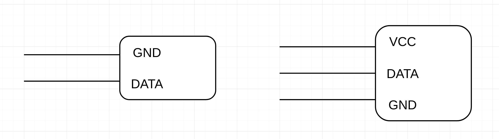
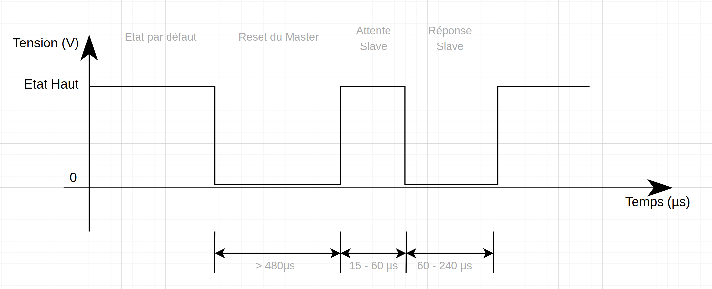

# Comment marche le bus 1-Wire ?

Dans cet article, nous allons voir comment marche un bus un peu particulier. 
Le 1-Wire, le concept est simple. Un seul fil pour communiquer entre le `Master` et le `Slave`.

## Point Histoire

TODO

<!-- truncate --> 
## Allo, il y a quelqu'un ?

> Non, y a personne :wink:

On appelle ce genre de bus, des bus Half-Duplex. 
Un bus half-duplex, cela veut dire que les deux entités peuvent parler sur le bus mais pas de maniere simultané. 

### Cablage

Les appareils qui utilisent le bus `1-Wire` ont trés souvent : 
- Pin 1 -> DATA
- Pin 2 -> VCC 
- Pin 3 -> GND

Il faut savoir que certains equipements peuvent etre alimentés via le fil de `DATA` car l'etat du bus par défaut est "HIGH".
La norme fait en sorte que les mise a l'etat bas (0V) soit inferieurs a 60ms. 
Il suffit donc d'avoir un condensateur de decoupage au niveau de l'alimentation pour liser la tension.

## Au debut du commencement

Afin de lancer la communication, le `Master` doit se mettre a l'etat bas (0V) pendant plus de 480µs. Apres cela, le `Slave` devra a son tour mettre a l'etat bas le fil de Data pendant 60µs.

## Master to Slave

- Envoi 0
- Envoi 1

### POV Slave

## Slave to Master 

- Envoi 0
- Envoi 1

### POV Slave 
 

## 1-Wire with UART 

TODO

## Conclusion
- Limitation Technique
- Interet 

Sources :
- [Domadoo Guide](https://blog.domadoo.fr/guides/principe-du-protocole-1-wire/)

