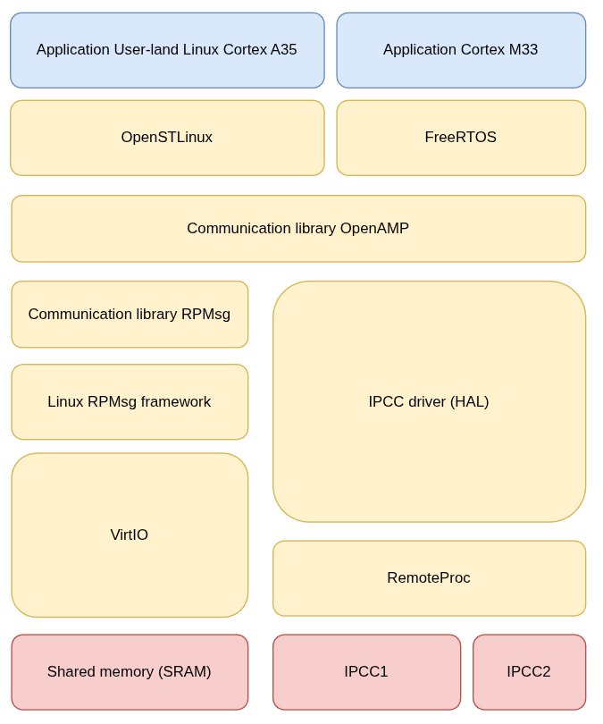
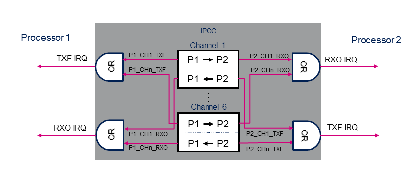
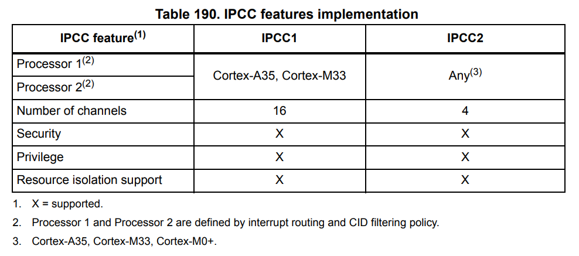
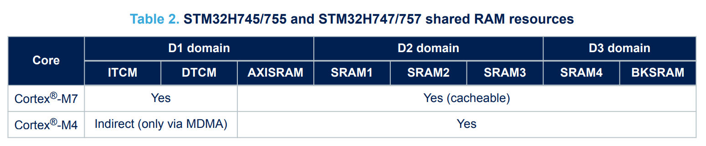
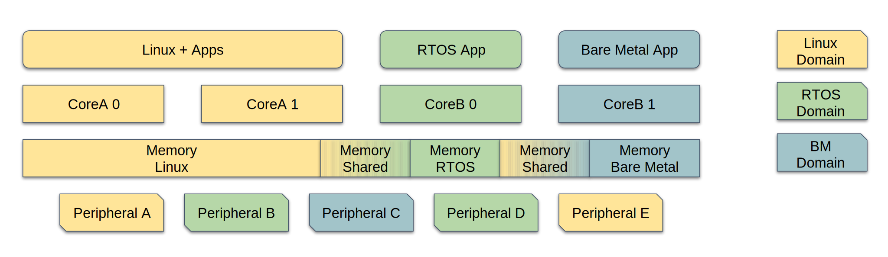
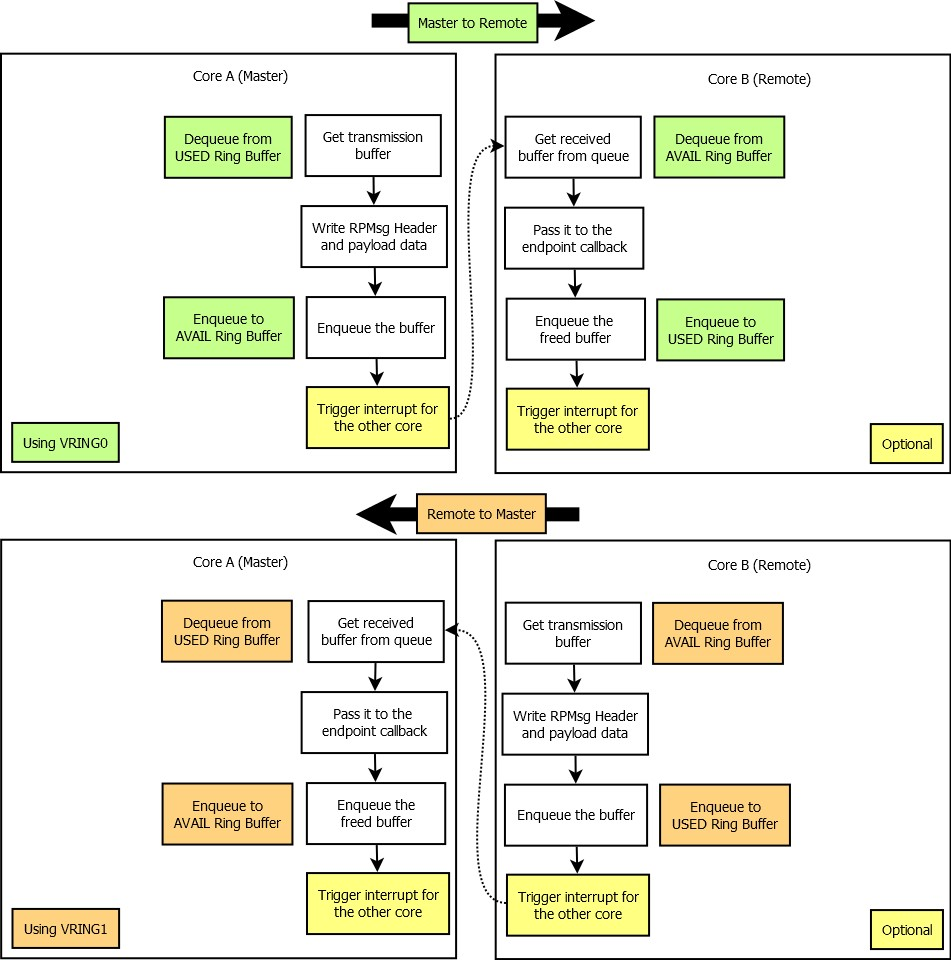
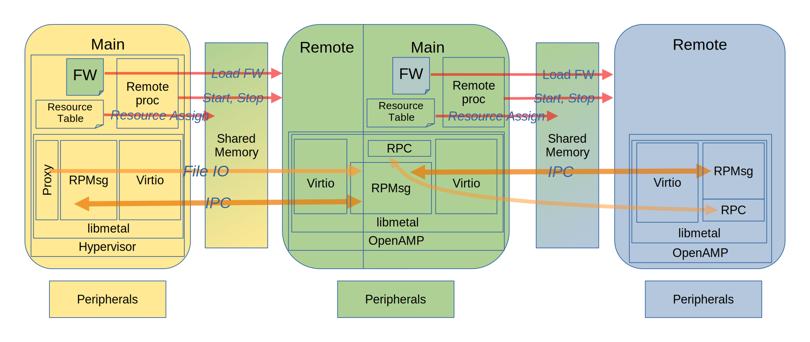
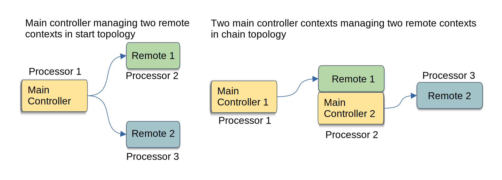

# Introduction

In modern embedded systems, it is common to find multiple processor cores (CPUs) working together, each potentially running a different operating system — for example, Linux on a Cortex-A core and an RTOS such as FreeRTOS on a Cortex-M. 

Communication between these cores is essential, but there is no single standard to achieve this. OpenAMP, with its RPMsg and RemoteProc components, provides a flexible and widely adopted solution for intercommunication between Linux and RTOS or bare-metal systems.

<!-- truncate-->
---

## What will and will not be covered

This article focuses on the principles of inter-processor communication between heterogeneous processors (Linux and RTOS) in embedded systems, using OpenAMP and its components. We will explain how the key mechanisms work (RPMsg, RemoteProc, IPCC, VirtIO). We will not dive into implementation details (assembly code, hardware registers).

---

## Prerequisite

* **ARM Programming (STM32):** basic knowledge of the ARM architecture.
* **C language:** used for embedded development.
* **Understanding of an RTOS or Linux:** basic concepts of real-time operating systems (RTOS) and/or Linux.

---

## Targeted audience

* **Engineering students** interested in exploring multi-core embedded systems.
* **Beginner engineers** in the field of embedded software.

---

## Global Overview

To better understand the architecture, here’s a diagram that illustrates the separation between the Linux and RTOS environments, and the communication mechanisms between them:



> *Figure 1: OpenAMP architecture overview between Linux and RTOS*

---

## Booting and managing the remote core

### How does IPCC work?

IPCC (Inter Processor Communication Channel) is a hardware peripheral found on some STM32 microcontrollers, such as the STM32MP1 family. It allows interrupts to be triggered between microcontrollers.

This component consists of several channels. For example, the STM32MP257F has 16 channels on IPCC1 [^MP257F Lines].



> *Figure 2: How the IPCC hardware component is working for 6 channel (STM32MP157F)*

A board may include multiple IPCC peripherals. They enable communication between two or more processors. The IPCC2 peripheral allows communication between all Cortex cores on the board.



> *Figure 3: Extract from the documentation of the STM32MP257F*


Each channel has a specific function. For example, channel 3 [^MP257F Lines] is used by the RemoteProc framework to shut down the Cortex-M33.

[^MP257F Lines]: https://wiki.st.com/stm32mpu/wiki/IPCC_internal_peripheral#On_STM32MP2-lines_3

---

### Life Cycle Management 

RemoteProc [^Remoteproc] is a framework used to manage the lifecycle (boot, shutdown, supervision) of a remote processor. On Linux, RemoteProc can be used to load a firmware image onto a Cortex-M core (running an RTOS or bare-metal), monitor its state, or shut it down.

```c
int remoteproc_start(struct remoteproc *rproc); 

int remoteproc_stop(struct remoteproc *rproc); 

int remoteproc_shutdown(struct remoteproc *rproc);
```

RemoteProc relies on specific drivers and on the firmware’s resource table to allocate shared memory and required peripherals.

[^Remoteproc]: [https://docs.kernel.org/staging/remoteproc.html](https://docs.kernel.org/staging/remoteproc.html)

---

### Role of IPCC in triggering remote boot

IPCC plays a key role in booting the remote core. When Linux wants to start a firmware on an RTOS core, it uses IPCC to send an initialization signal. This signal triggers the remote core boot process, allowing it to initialize its own environment. IPCC can also be used to synchronize other actions, such as data exchange or critical event notification.

---

## Inter-Processor Data Exchange

### VirtIO

Communication between cores primarily takes place through shared memory (SRAM).



VirtIO is a standard that defines a protocol for communication between drivers and devices of different types.

:::tip
The choice of shared memory must consider security (restricted access), performance (latency, bandwidth), and manageability (size, alignment).
:::

#### Ring Buffer

The framework uses ring buffers, which can be seen as channels with their own queues.

VirtIO relies on a shared-memory ring buffer mechanism called VRing. Each VRing is made of two parts:

- **`AVAIL`**: A ring where the sender posts available buffers.
- **`USED`**: A ring where the receiver posts completed buffers.

Each side writes only to its own ring (sender to `AVAIL`, receiver to `USED`), preventing race conditions.
VirtIO supports multiple VRings, allowing concurrent communication channels (e.g., one for commands, one for data, one for control messages).

---



> *Figure 4: Resource assignement example for IPC*


---

### RPMsg abstraction

RPMsg is a VirtIO-based messaging bus that allows kernel drivers to communicate with remote processors present in the system. It provides the infrastructure to exchange wire-protocol messages between client drivers. These drivers can then expose appropriate user space interfaces if needed.

The RPMsg client driver implements a service associated with the remote processor. This driver is probed by the RPMsg framework when a corresponding service is announced by the remote processor via a “new service announcement” RPMsg message.



#### RPMsg Client Driver
The RPMsg client driver serves to handle a specific communication service between cores. For example, if the remote core exposes a logging or file-access service, an RPMsg client driver on Linux receives the message and routes it to the appropriate Linux subsystem.

It abstracts the low-level messaging details, allowing developers to implement high-level inter-core services (e.g., sensor acquisition, control, logging, RPC).

##### Why recode this driver?

You may want to re-implement or customize an RPMsg client driver in these situations:
- You are designing a custom protocol or service not covered by existing drivers.
- You need to support a proprietary message format or payload.
- You want to expose RPMsg messages to user space differently (e.g., via character device, netlink, or custom interface).
- You need to implement secure or encrypted communication on top of RPMsg.

By customizing the RPMsg client driver, developers can fully adapt the communication stack to their application's needs.

[RPMsg Communication flow]: https://openamp.readthedocs.io/en/latest/protocol_details/rpmsg_comms.html#rpmsg-communication-flow

---

### OpenAMP high-level interface

OpenAMP’s high-level interface integrates and abstracts the complexities of managing remote cores and orchestrating inter-processor communication (IPC) in heterogeneous multicore environments. By leveraging RemoteProc for lifecycle management, RPMsg for robust messaging, and VirtIO for virtual device abstraction.



OpenAMP enables seamless control and data exchange between master and remote processors—regardless of whether they run Linux, RTOS, or bare-metal firmware.

The framework’s support for various topologies (star, chain, or combined) and its compatibility with industry-standard IPC mechanisms (such as IPCC, Mailbox, and RPMsg) further enhance its flexibility and reliability in real-world deployments.


#### OpenAMP Proxy

The framework’s proxy mechanism extends this interoperability, allowing system calls such as open, read, and write to be transparently forwarded from an RTOS or bare-metal context to Linux, effectively giving remote cores access to host filesystem resources without requiring a full OS stack. 

This is really valuable in scenarios where resource-constrained remote cores need to offload I/O operations to a more capable master processor.

## What's the difference between Linux and FreeRTOS on IPC?
The main difference between Linux and FreeRTOS regarding Inter-Processor Communication (IPC) lies in the abstraction layers and available mechanisms:

Linux: Drivers and frameworks (RemoteProc, RPMsg, VirtIO) are tightly integrated into the kernel. This integration provides fine-grained control over resources and peripherals, enabling robust and scalable IPC solutions. For instance, on STM32MP1xx, Linux can communicate with the Cortex-M4 core using OpenAMP-based virtual UART devices, which appear as TTY devices in the Linux filesystem and allow for message passing and synchronization via shared memory and IPCC peripherals.

FreeRTOS (or RTOS in general): OpenAMP provides a lightweight library implementing similar concepts as Linux, but with an interface simplified for real-time constraints. Each vendor porting OpenAMP provides an implementation of libmetal for their system. For example, STM32MP1xx has strong support for OpenAMP, with documentation and examples dedicated to testing the library on these devices.

[^STM32MP157C]: https://openamp.readthedocs.io/en/latest/demos/system_reference-ST.html

### LibMetal
LibMetal is the abstraction layer used by OpenAMP to manage hardware resources and portability. On FreeRTOS, libmetal is typically provided by the vendor and adapted to the specific hardware and RTOS environment, enabling OpenAMP to function across different platforms and RTOSes.

For instance, on STM32MP1xx, the OpenAMP middleware initializes and configures the IPCC peripheral through HAL, sets up the OpenAMP/RPMsg framework, and creates virtual UART instances for IPC. The Cortex-M4 firmware (running FreeRTOS or bare metal) communicates with Linux on the Cortex-A7, using shared memory and IPCC for synchronization.

## Closing remarks

OpenAMP is a powerful framework for intercommunication between Linux and RTOS or bare-metal cores in multi-core embedded systems. It relies on open standards (RPMsg, VirtIO, RemoteProc) and uses hardware peripherals such as IPCC for synchronization. Understanding these mechanisms is essential to designing modern, flexible, and high-performance embedded systems.

However, it’s important to remember that, like in any field (and especially in IT) this technology is just one among many. If this topic has piqued your interest, I encourage you to learn more about Symmetric Multi-Processing [^SMP] (SMP).

[^SMP]: https://en.wikipedia.org/wiki/Symmetric_multiprocessing

---

## Glossary

* **LCM** – Life Cycle Management of remote processor: managing the remote processor's lifecycle (boot, stop, supervision).
* **RPMsg** – Lightweight messaging protocol used over shared memory.
* **RemoteProc** – Framework for booting and managing remote cores.
* **IPCC** – Hardware peripheral for signaling between processors.
* **AMP** – Asymmetric Multi-Processing: architecture where multiple processors run different operating systems.
* **OpenAMP** – Middleware for AMP communication (based on RPMsg + RemoteProc).
* **VirtIO** - Standard that allows virtual machines to efficiently access simplified virtual devices, such as network and storage.
* **VRing** – A data structure (ring buffer) defined by the VirtIO specification, used to organize and exchange buffers.

---

## References and Further Reading

### Virtio Mechanisms

* [Linux Virtio](https://docs.kernel.org/driver-api/virtio/virtio.html)
* [Virtio Specification v1.2](https://docs.oasis-open.org/virtio/virtio/v1.2/virtio-v1.2.html)

### IPCC Mechanisms

* [STM32 IPCC](https://wiki.st.com/stm32mpu/wiki/IPCC_internal_peripheral#Peripheral_overview)
* [Zephyr IPC Service](https://docs.zephyrproject.org/latest/services/ipc/ipc_service/ipc_service.html)
* [AN5617: IPCC Application Note](https://www.st.com/resource/en/application_note/an5617-stm32h745755-and-stm32h747757-lines-interprocessor-communications-stmicroelectronics.pdf)

### OpenAMP Library

* [Introduction to OpenAMP Library (Whitepaper)](https://www.openampproject.org/docs/whitepapers/Introduction_to_OpenAMPlib_v1.1a.pdf)
* [Coprocessor Management Overview on STM32MPx](https://wiki.st.com/stm32mpu/wiki/Coprocessor_management_overview)
* [STM32 Dual Core - Inter-core communication using HSEM (YouTube)](https://www.youtube.com/watch?v=QzICJz-xRzk)

### RPMsg

* [Linux RPMsg on OpenStLinux](https://wiki.st.com/stm32mpu/wiki/Linux_RPMsg_framework_overview)
* [Develop on Arm (STM32MP157x-EV1)](https://wiki.st.com/stm32mpu/wiki/Getting_started/STM32MP1_boards/STM32MP157x-EV1/Develop_on_Arm%C2%AE_Cortex%C2%AE-M4/Modify,_rebuild_and_reload_a_firmware)
* [Linux RPMsg driver source](https://github.com/STMicroelectronics/linux/blob/v6.6-stm32mp/include/linux/rpmsg.h)
* [Exchanging buffers with RPMsg](https://wiki.st.com/stm32mpu/wiki/Exchanging_buffers_with_the_coprocessor)

### Additional resources

* [Yocto meta-ipc layer](https://github.com/diegosueiro/meta-ipc)
