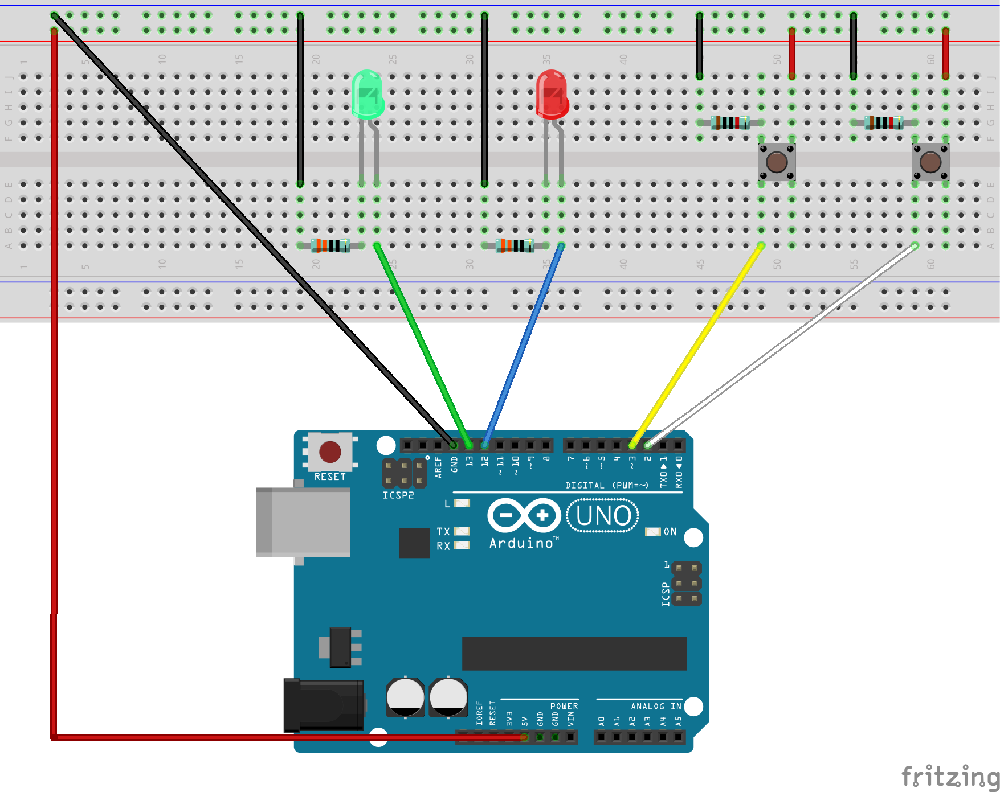
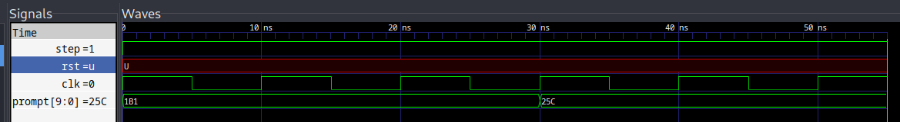

# Semaine inter promo GISTRE26

Bonjour les GISTRE 26 !

<!-- truncate-->
Dans la nuit, nous avons perdu un équipement précieux dans le local GISTRE. Les roots trop désorganisés ont besoin de votre aide pour retrouver de quoi il s'agit.
Le voleur a laissé une série d'indices que vous pouvez suivre pour retrouver de quel type d'objet a été dérobé.

Nous savons déjà que les différents indices forment un poème et que le nom de l'équipement est caché dans ce poème en lettres majuscules.

Chaque indice contient une partie du poème en base64. Certains indices sont encadrés par une balise suivant ce format :

```
GISTRE{partie_du_poème}
```

Cependant, attention ce n'est pas le cas de tous les indices.

Bon courage !
## Challenge 1

Un fichier étrange a été retrouvé. Saurez-vous trouver le premier indice ?

> [CH1 file](./CH1_strange_file.file)

## Challenge 2

Un indice s'est caché dans la [Documentation GISTRE](https://doc.gistre.fr/).
Fouillez le site !


## Challenge 3
Il est fortement possible qu'un autre indice ait été laissé sur le [blog GISTRE](https://blog.gistre.epita.fr/). Un peu de lecture s'impose.

## Challenge 4
<details>

Le voleur a fait tomber une carte en partant et a laissé un binaire sur une clé USB. Mettez le binaire sur la carte et connectez son port série. Peut-être découvrirez-vous quelque chose d'intéressant...

</details>

> [CH4 file](./CH4_interpromo.bin)
## Challenge 5
<details>

Une nouvelle alternative au CAN, appelée CAN-GISTRE vient de sortir.
Deux cartes de développement ont été volées et des données inconnues transitent. Nous avons réussi à dumper ce qui transite sur le bus CAN-GISTRE, il faudrait décoder tout ça pour reconstruire l’échange entre ces deux cartes. Une page de la documentation technique a été dérobée, nous espèrons qu’elle vous sera utile.


| Nom du champ | Start | ID | RTR  | IDE   | RESERVED | DLC | [DATA0...DATA7] | CRC | CRC Delimiter | ACK | ACK Delimiter | End of frame | IFS |
|:-------------|:-------|:----|:------|:-------|:----------|:-----|:-----------------|:-----|:-------------|:-----|:---------------|:--------------|:-----|
| Nb bits      | 1     | 11 |   1  |   1   |     1    | 4   | ...VARIABLE...  | 15  |       1       |  1  |       1       |      7       | 3   |
| Valeur*      | 0     | X  |  0   |   0   |     0    |  X  |       X         |  X  |       1       | 0   |  0            | 1111111      | 111 |

```
Champs Valeur
  0 : Bit récessif
  1 : Bit dominant
  X : Défini par utilisateur

```

(figure 1) Valeur des champs d'un trame GISTRE-CAN

**Description**
- Start: Début d'une trame
- ID: L'ID d'une trame
  - Priorité décroissante: L'ID le plus haut est la trame prioritaire
    Exemple: Si une trame a un id de 93 et une autre de 64, la trame 93 "gagne"
- RTR: Trame de request (0 si la trame est une trame donnée ou 1 si request)
- IDE: Identification de l'erreur
- RESERVED: Réservé à des révisions ultérieures
- DLC: Data length, taille de la donnée en octets (jusqu'à 15 octets)
- DATA: Donnée, codée sur 8 bits
  Taille variable de 0 à 15 octets
- CRC: CRC de la trame
- CRC Delimiter: Délimiteur CRC

Pour reconstruire un message complet, il est nécessaire de trier les messages
envoyé par ID par ordre décroissant. Le CRC peut être ignoré, seulement le
contrôleur CAN-GISTRE doit s'en servir. La couche applicative doit en revanche
utiliser à minima ID, le DLC et le DATA0-7.

Soit deux messages A et B encodé en ASCII:

**MESSAGE A:**
```
{'id': 1, 'dlc': 4, 'data': [83, 84, 82, 69], 'crc': 838}
0000000000010000100010100110101010001010010010001010000011010001101011111111111
```
Nous obtenons: "STRE"

**MESSAGE B:**
```
{'id': 2, 'dlc': 2, 'data': [71, 73], 'crc': 929}
000000000010000001001000111010010010000011101000011011111111111
```
Nous obtenons: "GI"

Le message reconstruit est le suivant en fonction de l'ID: "GISTRE"

</details>

> [CH5 file](./CH5_trame_can.file)

## Challenge 6
Le voleur a laissé derrière lui une carte mystérieuse. Nous vous laissons l'examiner.

## Challenge 7
Un étrange programme nous sort une seule et unique information, saurez-vous la trouver ? Il est pas mignon ce programme ?

> [CH7 file](./CH7_trial.file)

## Challenge 8 
Un ancien contact du LSE vous a dit qu’une partie de l’indice se trouve dans ce module kernel. Il n’y aurait qu’à l’installer…

> [CH8 file](./CH8_hint.ko)

## Challenge 9
<details>
Vous avez retrouvé un carnet volé par la mascotte GISTRE, entre deux pages collées, vous parvenez a déchiffrer ces lignes:
```
Lorsqu’on compile ces fichiers avec 
Alire (https://alire.ada.dev/),
il demande un mot de passe que 
le voleur à mis en place.
```
</details>

> [CH9 file](./CH9_split.zip)

## Challenge 10
<details>

Un contact au SEAL vous à donné une carte arduino et les plans d’un montage. Juste avant de disparaitre il vous a murmuré ces mots:
“Le vert c’est pour les majuscules, la gauche c’est pour la lettre suivante”. Saurez vous retrouver cette partie du poème ?


</details>

## Challenge 11
Ce binaire semble vérifier qu’un indice est le bon. Peut être il y a t’il moyen de retrouver l’indice à partir de la vérification ?

> [CH11 file](./CH11_re.file)
## Challenge 12
<details>
Un collegue de TCOM vous annonce qu’il a inventé un nouveau composant, un
cadenas electronique révolutionnaire. Vous ne connaissez pas le VHDL mais vous avez mesuré les différents signaux d’entrée. Saurez vous lui prouver que sa technologie est bonne pour la casse en lui montrant la valeur de sortie reconstituée ?



</details>

> [CH12 file](./CH12_Cadenas-VHDL.file)
## Challenge 13
Encore un coup de ce satané voleur, ce binaire semble se moquer de nous. Je suis sûr que vous en viendrez à bout avec vos outils favoris.

> [CH13 file](./CH13_FindMEEEE_GISTRE.bin)
## Bonus
<details>
La résolution de cette épreuve vous donnera accès instantanément au choix suivant:
- 1 indice choisi par le groupe
- 2 indices aléatoires
</details>

> [Bonus](./Bonus_Alerte.zip)
### Alerte SRS !

Vite les bleus,

Notre espion Michel s'est introduit dans la salle serveur des SRS, pour essayer d'obtenir plus d'informations sur leur plan diabolique d'invasion complète de l'espace GISTRE au lab. Il a réussi à brancher discrètement une stm32 qui monitore l'utilisation hardware de leurs serveurs.

Il a aussi entendu une conversation entre deux SRS très sournois parlant d'un algorithme de signature sur courbes elliptiques qu'ils ont implémenté eux-même et affirmant qu'il est incassable. Entre deux phrases de conspiration, il est sûr d'avoir entendu les mots `équation` et `Weierstrass`. Peut-être qu'il y a une faiblesse à exploiter qu'ils ne connaissent pas ?

Vous avez à votre disposition des graphes et des analyses de consommation électrique et de temps de calculs de leurs serveurs calculant 60 fois la même signature avec la même clef privée ECDSA.

Nous avons passé ces données aux TCOM pour nous aider dans la lutte contre le joug SRS mais comme ils ne sont jamais au lab, on a eu aucun résultats et notre expert crypto est injoignable. Vous êtes notre dernier espoir pour empêcher les SRS de dominer le lab, retrouvez la clef privée ECDSA qui permet de signer leurs messages pour nous permettre de déjouer leurs plans.

---

C'est la fin, avez-vous trouvé quel type d'objet a été dérobé ?

## Crédits

Merci aux GISTRE 2023 qui nous ont transmis les challenges qu'ils avaient fait pour notre année : 
- Pierre-Emmanuel Patry
- Alexandra Petit
- Benoit Malhomme
- Martin Grenouilloux

GISTRE 2024 qui ont participé à la mise en place du CTF cette année : 
- Léo Benito
- Daniel Frederic
- Célien Aubry
- Clarisse Blanco

GISTRE 2025 qui ont participé à la mise en place du CTF cette année : 
- Besma Talbi
- Renaud-Dov Devers
- Marc Bastrios
